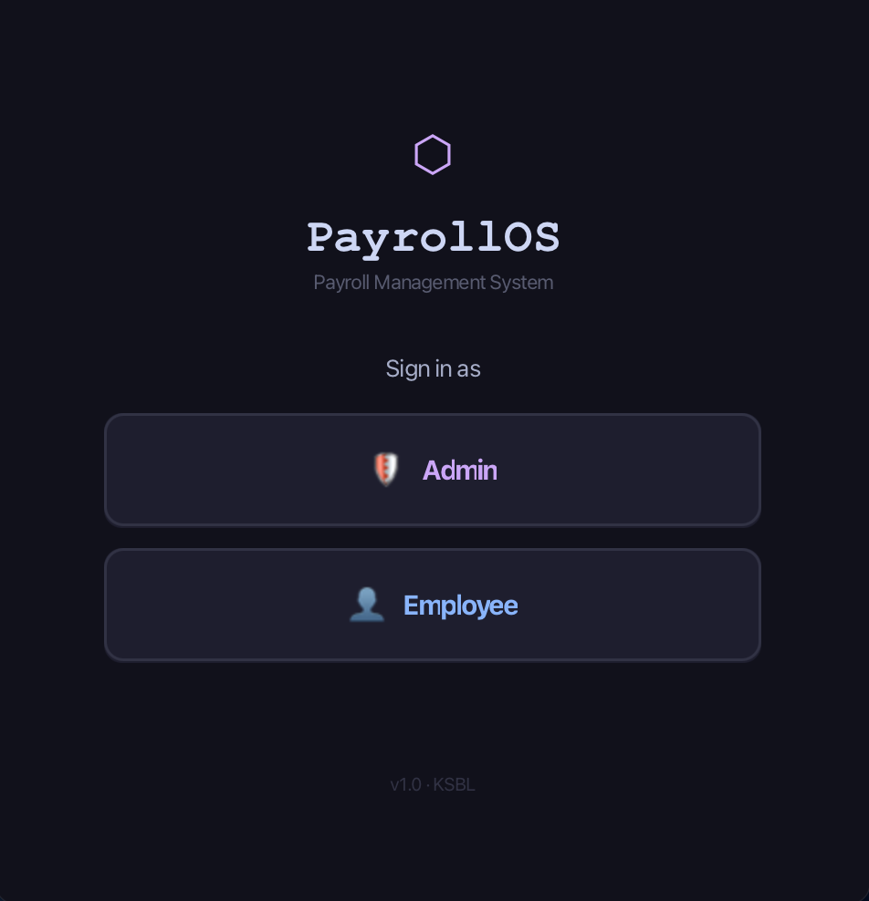
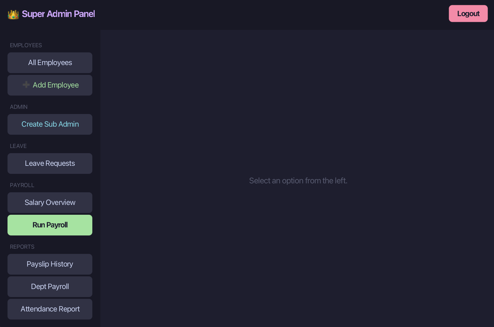
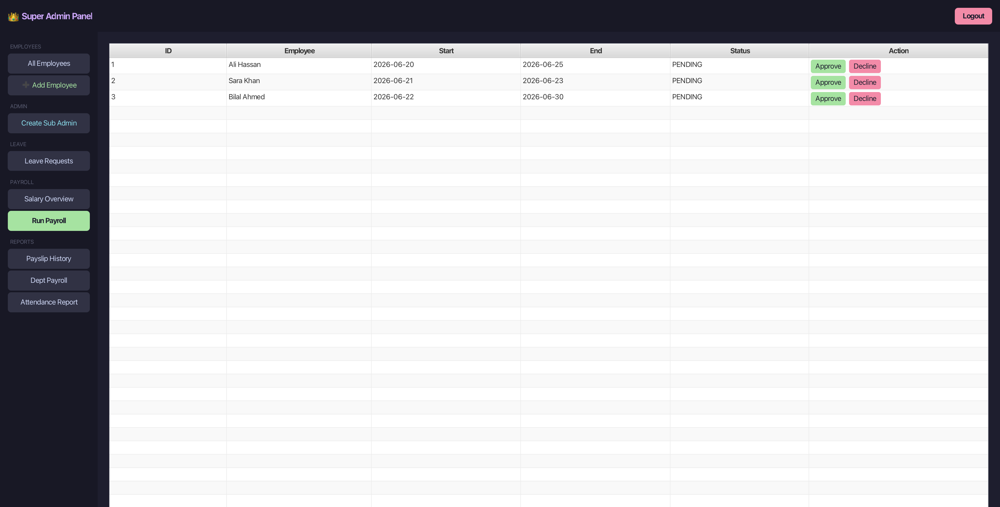
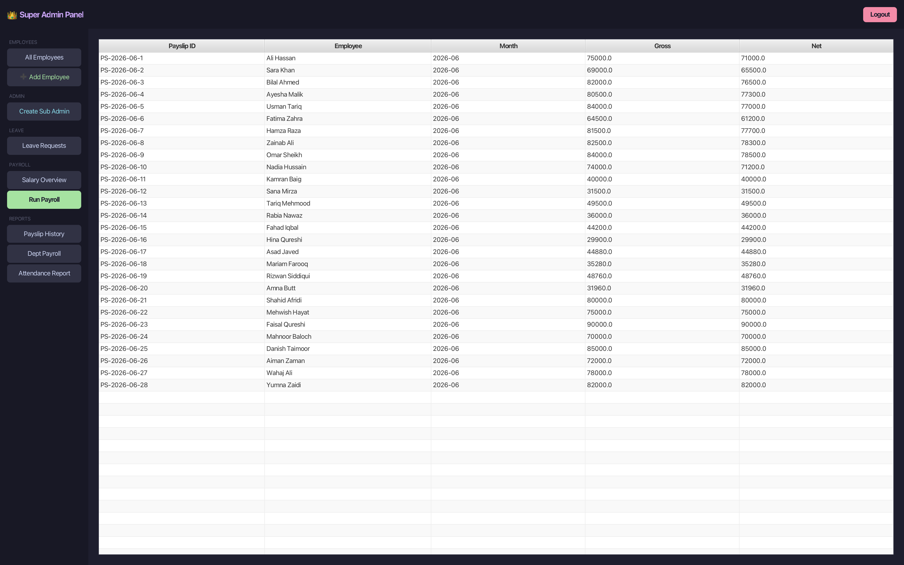
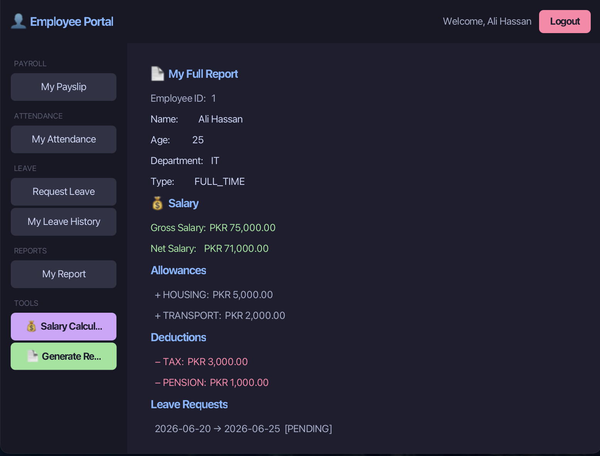
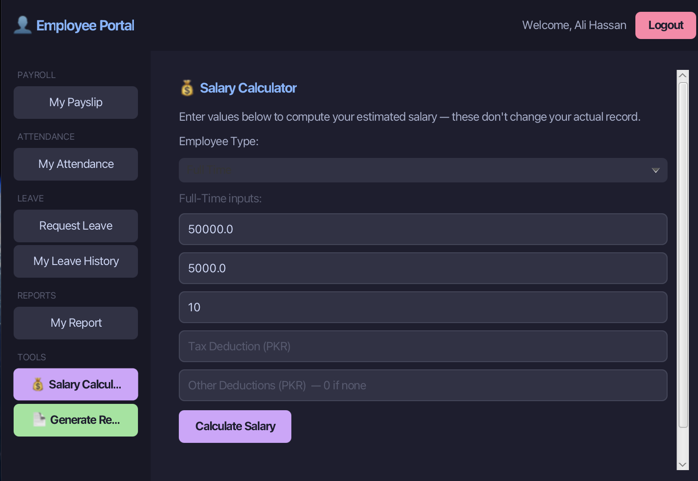

# Payroll Management System

A desktop payroll management application built with **Java**, **JavaFX**, and **MVC architecture**. Designed to simulate a real-world HR payroll workflow with role-based access control, polymorphic salary calculation, and CSV-based data persistence.

> **Academic Project** — BSCS, Karachi School of Business & Leadership (KSBL), Spring 2026
> **Viva Score: 10 / 10**

---

## Screenshots

### Login Screen

### Super Admin Dashboard

### Leave Request Management

### Payroll History

### Employee Portal — Full Report

### Employee Salary Calculator

---

## Business Problem

Manual payroll processing is error-prone and time-consuming. This system automates salary calculation across different employment types, manages leave requests through an approval workflow, and enforces a strict role hierarchy — so only authorized personnel can perform sensitive actions.

---

## Features

### Role-Based Access Control
Three distinct user roles with separate dashboards and permissions:

| Role | Capabilities |
|---|---|
| **SuperAdmin** | Full access — add/remove employees, manage SubAdmins, approve/reject leaves, view all payroll |
| **SubAdmin** | Approve/reject leave requests, view payroll reports — cannot create other admins |
| **Employee** | View own salary, submit leave requests, view payslip |

### Polymorphic Salary Calculation
Three employee types with different salary logic, all handled through a unified `PayrollManager`:

- **Full-Time** — fixed monthly salary + overtime rate × overtime hours
- **Part-Time** — hourly rate × hours worked
- **Contract** — fixed contract amount with expiry date tracking

### Allowances & Deductions
Each employee can carry multiple allowances (Housing, Transport, Medical, Bonus) and deductions (Tax, Pension, Insurance), all factored into the final net salary calculation.

### Leave Request Workflow
Employees submit leave requests with start/end dates → requests appear in SubAdmin/SuperAdmin dashboard → approved or rejected with status update reflected in employee view.

### CSV Data Persistence
Employee records and accounts are saved to `employees.csv` on first run and reloaded on subsequent launches. No database required — portable and lightweight.

### Payslip Generation
`PayrollManager` processes monthly payroll for all employees and generates individual payslips viewable per employee, including gross pay, allowances, deductions, and net salary.

---

## Tech Stack

| Layer | Technology |
|---|---|
| Language | Java 17 |
| GUI Framework | JavaFX |
| UI Layout | FXML |
| Architecture | MVC (Model-View-Controller) |
| Data Persistence | CSV (custom DataStore) |
| Build Tool | Maven |

---

## Project Structure

src/main/java/

├── app/              # Entry point, AppData, DataStore (CSV I/O)

├── auth/             # UserAccount, EmployeeAccount, SubAdminAccount, SuperAdminAccount

├── controller/       # JavaFX controllers for each screen

├── enums/            # EmployeeRole, AccessRole, LeaveStatus, AllowanceType, DeductionType

├── interfaces/       # Shared contracts (e.g., Payable)

├── model/            # Employee, FullTimeEmployee, PartTimeEmployee, ContractEmployee,

│                     # PayrollManager, LeaveRequest, Allowance, Deduction, Payslip

├── reporting/        # Payslip generation logic

└── view/             # FXML layout files

---

## Seed Data (28 Employees)

The system seeds 28 employees on first run across three employment types:

- **10 Full-Time** employees across IT, HR, and Finance departments
- **10 Part-Time** employees with hourly rates and hours worked
- **8 Contract** employees with fixed amounts and contract expiry dates

All full-time employees carry pre-configured allowances and deductions. Two employee login accounts are seeded by default (`ali123` / `sara456`).

---

## Key Implementation Challenges

**PayrollManager** — the core backend class. Responsible for iterating all 28 employees, dispatching salary calculation to the correct subclass via polymorphism, applying allowances and deductions, and generating payslip objects for the current `YearMonth`. Getting the aggregation logic right across three different salary models while keeping the manager decoupled from employee subtypes was the most complex part of the build.

**MapList pattern** — used to maintain fast lookup of employees to their payslips without duplicating data across the role hierarchy.

---

## Download

This project was packaged as a standalone macOS desktop application (.dmg).
The app runs without any IDE or Java installation required.

> .dmg file not included in this repository due to file size. Contact me for a demo.

---

## What I Learned

- Designing a multi-layer MVC architecture in JavaFX from scratch
- Polymorphism in practice — same `processMonthly()` call producing different results per employee type
- Role-based access control without a database — pure object graph design
- CSV serialization/deserialization as a lightweight persistence layer
- Separating UI logic (controllers) from business logic (model/PayrollManager) cleanly
- Managing shared state across multiple controllers via a central `AppData` object

---

## Author

**Muhammad Ammar Saleem** — [@m2ammar](https://github.com/m2ammar)
BSCS Data Science, KSBL Karachi
[LinkedIn](https://www.linkedin.com/in/muhammad-ammar-b533a0323/)

## Contributors

- Fatima Naeem
- Abdul Hadi

